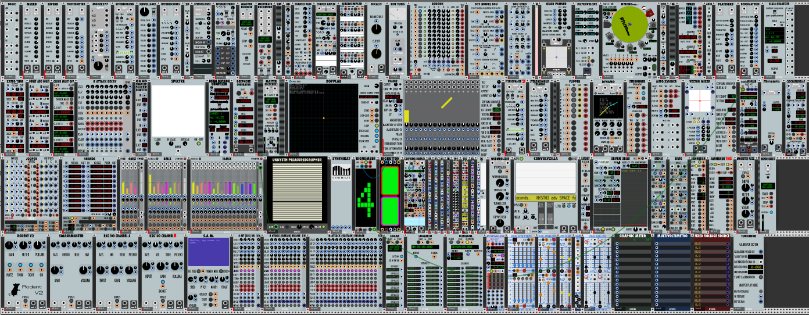

# The NYSTHI Manual (Writing) Project!

Manual project for the [NYSTHI modules plugin](https://github.com/nysthi/nysthi) in [VCV Rack](https://vcvrack.com/)! 

[Join our NYSTHI Manual team on Facebook!](https://www.facebook.com/groups/nysthimanual/)

---

## Directory

[THE NYSTHI BASICS!](pages/basics/basics.md)

| **Clocks** | **Filters** | **Boolean Logic** | **Sequencers** |
|---|---|---|---|
| [MetaAardvark](pages/metaaardvark/metaaardvark.md) | [4DCB](pages/4dcb/4dcb.md) | [Logic](pages/logic/logic.md) | [Squonk](pages/squonk/squonk.md) |
|  | [Dica 33](pages/dica_33/dica_33.md) |  |  |

| **Envelopes** | **Delays** | **Utilities** | **Blanks** |
|---|---|---|---|
| [Complex DelayAttackHoldDecay](pages/complex_dahd/complex_dahd.md) | [NYECHOecoeco](pages/nyechoecoeco/nyechoecoeco.md) - WIP | [BigNumber](pages/bignumber/bignumber.md) - WIP | [Nysthiometer](pages/nysthiometer/nysthiometer.md) |

WIP = Work In Progress

Last updated 2019-01-25 (0.6.38)
