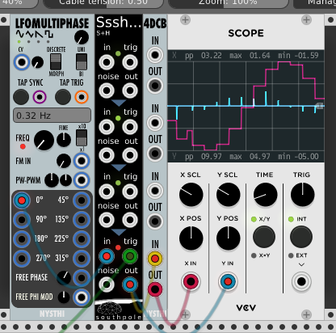

# 4DCB

Antonio says: 

	0.5.12.0
	
	a 4 times DC BLOCK filter, current sample rate aware
	
	---- needed to avoid unwanted Direct Current build up a the end of a module
	
	0.5.13.0

	it is possible to set the HP frequency from PRESETs in the contextual menu (5, 10, 15, 20  30 Hz)
	
	0.6.2
	
	solved a crosstalk bug (some cleaning for the 4 dc filters!)
---

Type: Utility / (Limited) High Pass Filter

Size: 2 HP

4DCB is 4 instances of a High Pass Filter, which when used as intended, will keep Direct Current from reaching your speakers [\(*a **very** bad thing*\)](https://electronics.stackexchange.com/questions/233230/why-are-dc-signals-bad-for-loud-speakers).

In the image above, the S+H is beig clocked at 2 HZ, and the 4dcb is set to 30Hz (via the context menu). The DC (pink line) signal is being attenuated before it can pass through to the output (as shown by the blue line).

Extra Context Menu Options: 

- Set to *(5, 10, 15, 20, 30)* Hz
