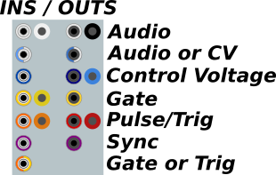
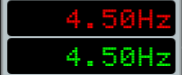

# Demystifying NYSTHI (aka the basics)

Author: Pat McIlveen (@patman023)

Last Updated: 2019/01/10

Last Patch: 0.6.38

**INDEX** 

1. [Jacks](#jacks)
2. [Displays](#displays)
3. anything else we need?

---

## Jacks

Here's the color coding for the Jacks, so that you can understand what kind of signals work best where! 

Both the Standard and Buchla variants are included.

**Audio**: Periodic signals above 2 Hz

**Control Voltage (CV)**: Signals typically between +/-10 V, used to control parameters of a module. Examples include LFOs and Envelopes (but can be literally anything! EXPERIMENT!).

**Gate**: A Pulse Wave of +10 V with a variable duration. Think of a key on a keyboard being held (turning it on) and released (which turns it off). 

**Pulse/Trigger**: A +10 V signal, typically with a duration of 1 ms (older modules with the 0.1 ms duration are being updated) 

**Sync**: A special-purpose Trigger sometimes used as a reset (as in LFOMULTIPHASE) as well as the μ Series modules.

---

## Displays

***WORK IN PROGRESS***

***screengrab the SQ2***

---

## anything else we need? [LET US KNOW!](https://github.com/patman023/nysthimanual/issues)
