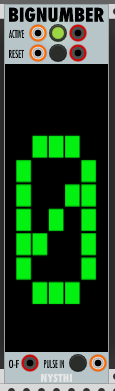

# BigNumber

Author: Pat McIlveen / @patman023

Last Updated: 2019/01/25

Last Patch: 0.6.38

**INDEX**

1. [Antonio Says](#antonio-says)
2. [Basics](#basics)
3. [Functions by Section](#functions-by-section)
   - [Section A](#section-a--active--reset)
   - [Section B](#section-b--display)
   - [Section C](#section-c--pulse-train)
   - [Section D](#section-d--context-menu)
4. [Usage](#usage)
5. [Sample Patches](#sample-patches)

---

## Antonio Says

<details>
  <summary>Click to see the Changelog</summary>

```
	0.6.22
- a utility to present a single figure counter
- you can combine many of them to have more sofisticated counters, using the contextual menu to set the overflow mode commands
---- ACTIVE: IN PULSE, TAP, OUT PULSE
---- RESET: IN PULSE, TAP, OUT PULSE
---- OVERFLOW (OF): out PULSe whne the OVERFLOW limit is reached
---- PULSE IN, TAP, to increment the COUNTER
- via contextual menu it is possible to set in count beat mode (to count from 1 and not from 0)
---- via contextual menu it is possible to set the overflow (so you can set it as clock, for example, if the pulses are seconds)

	0.6.38
---- feature request: add RESET to the nex clock IN (uses the contextual menu)
---- the dispaly will present the status

```

</details>

---

## Basics

 **Needs better images with reset armed mode and RClick menu on 0.6.39**

Type: Utility

Size: 7 HP x 3U

---

## Functions by Section

### Section A (Active/Reset)

ACTIVE: An On/Off toggle which enables the [Pulse Train](#section-c--pulse-train). It includes INPUT and OUTPUT jacks to chain multiple BigNumbers together. The INPUT accepts both Pulses and Gates, while the OUTPUT sends a Pulse. The light-up pushbutton can also be used, which sends a Pulse via OUTPUT.

RESET: A Momentary switch which Resets the counter based on what modes are selected in the [Context Menu](#section-d--context-menu). Includes INPUT and OUTPUT jacks to chain multiple BigNumbers together The INPUT accepts both Pulses and Gates, while the OUTPUT sends a Pulse. The pushbutton can also be used, which sends a Pulse via OUTPUT. 

       - A RESET will *not* trigger a Pulse on the O-F OUTPUT, and disarms it (if armed).

### Section B (Display)

A large, non-interactive display which shows primarily the counter. 

"NEXT PULSE RESET" appears when "Reset to the next CLOCK IN" is activated in the [Context Menu](#section-d--context-menu). In that same mode, "RESET ARMED" appears when a signal has been received at the RESET, and disappears the next time a Pulse is received at [PULSE IN](#section-c--pulse-train).

### Section C (Pulse Train)

O-F: This OUTPUT jack sends a pulse whenever the counter reaches its target, as set in the [Context Menu](#section-d--context-menu).

PULSE IN: Both a pushbutton and INPUT jack, which when receiving a signal will either increment or decrement the counter by 1 (depending on the mode set in the Context Menu).

### Section D (Context Menu)

#### COMMANDS

Reset to the next CLOCK IN: This mode is used to counter a specific technical issue, where a RESET and PULSE IN are received within close succession of each other. Activate this mode if you do not see the desired digit appear when you hit reset.

#### COUNT BEATS

Beat Count Mode: If using the module to display a number of beats, or any situation where there is no "0th step", activate this mode. A RESET or Overflow will start the counter at 1 instead, and 0 will be shifted to the end of the counter (to enable the display of numbers like "10" when chained).

#### OVERFLOW

Overflow on \[Digit\]: When the counter reaches the specified digit, it arms the [O-F OUTPUT](#section-c--pulse-train). When the next Pulse is received at PULSE IN, the O-F OUTPUT will fire a Pulse, and the counter will reset based on what other options are selected.

***WORK IN PROGRESS***
***WILL CHANGE ON RELEASE OF 0.6.39***

---

## Usage


---

## Sample Patches


