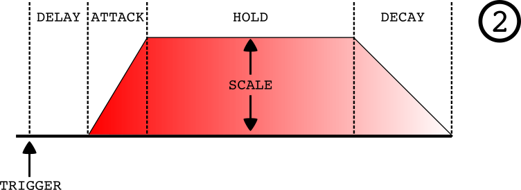
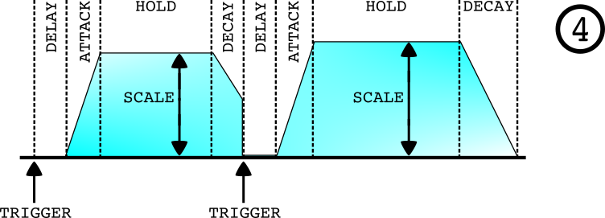
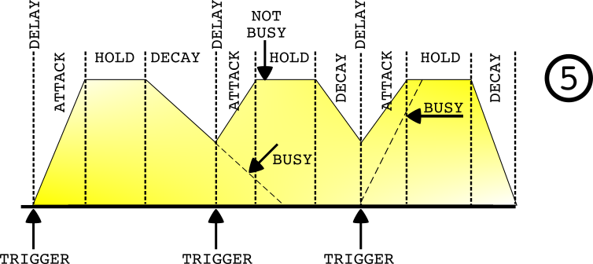

# Complex DAHD 

Author: Jim Aikin (@midiguru23)

Editor: Pat McIlveen (@patman023)

Last Updated: 2018/12/22 (0.6.35)

**INDEX**
1. [Antonio says](#antonio-says)
2. [Basics](#basics)
3. [Functions by Section](#functions-by-section)
   - [Contour](#contour)
   - [Action](#action)
   - [VCA](#vca)
   - [I/O](#i--o)
4. [Usage](#usage)
5. [Sample Patches](#sample-patches)


## Antonio says:

```
	0.4.10
an envelope with 2 stage with delays
controls:
- DELAY (timing delay from 0 to 10 secs) is the time after the trig and before the Attach stage
- DELAY CV (CV for the DELAY)
- ATTACK (timing attack from 0 to 10 secs)
- ATTACK CV (accept also negative values like, will be subtracted form the main value)
- HOLD (timing from 0 to 10 secs) Holds 1 till the the Decay stage is reached
- HOLD CV (CV for the HOLD)
- DECAY (timing decay from 0 to 10 secs)
- DECAY CV (CV for the HOLD)
- LIN-EXP curve modifier, from linar to exponential
- SCALE can scale Envelope for -2x to 2x (default to -1) (is used to invert the envelope)
- SCALE CV (CV for SCALE)
- TRIG BTN to start the envelope manually
- TRIG IN accept trig to start envelope
- TRIG OUT aoutput a trigger, when a trig is received, or the button is pressed (to make chains)
- LOOP button to have a cyclable DAHD
- LOOP TRIG IN the LOOP mode can be activated using a trig
- HANG button to have the DAHD stopped in the HOLD max value status indefinetively
- HANG TRIG IN the HANG mode activated using a trig
- VCA IN OUT, a simple insert to get a signal already amplified using the DAHD
- ENV OUT LED the metering of current status
- ENV OUT the envelope signal

END OF STAGE TRIGGERS
- EOD (End of Delay) out: triggers out when the Envelope reach the ATTACK phase
- EOR (End of Rise) out: triggers out when the Envelope reach the HOLD phase
- EOC (End of Hold) out: triggers out when the Envelope reach the DECAY phase
- EOC (End of Cycle) out: triggers out when the Envelope reach the STABLE phase

	0.4.11
- added BUSY command (the DAHD will react to trigs only in STABLE state)
- added ZERO command (the DAHD will react to trig starting always with at ZERO and not from the current ENV point)

	0.5.10.0
- add a second VCA to process in stereo

	0.5.12.0
- added envelope chain IN, to have complex chained envelopes
```

---

## Basics


Type: Envelope / VCA / LFO

Size: 6 HP

Modeled After/Inspired by: Buchla 281e/Serge USG

---

## Functions by Section


### Contour

The first six controls modify the contour of the signal generated by the module. 

DELAY, ATTACK, HOLD, AND DECAY (and their associated CV inputs), each control the length of time the module will spend in the respective stages. 



While the more familiar ADSR (Attack Decay Sustain Release) envelope generator has a Sustain parameter which controls the segment's ***level***, note that all of the DAHD's main parameters control their respective segments' ***durations***.

Additionally, the DELAY segment keeps the module at baseline voltage for a period after a trigger is received.

The LIN to EXP knob controls the shape of both the attack and decay slopes. When it's turned to the right, the attack slope will be convex and the decay slope concave (that is, exponential), which will make them seem quicker. When it's turned to the left, the slopes will be nearly linear. 

The SCALE knob controls the minimum and maximum levels of both the envelope signal, and the VCAs. ***(Default: Min 0V/Max +10.00 V)***

At settings above 12 o'clock, the envelope's baseline is 0 V, and the maximum ranges from 0.00 V to +20.00V 

At settings below 12 o'clock, the envelope's baseline ranges from +20.00 V to 0.00 V, and the minimum is 0 V

### Action

The module's cycle can be TRIGgered via both manual button press, as well as a patched external signal.

The CHAIN TRIG OUT duplicates any TRIGs either generated or received by the module.

The LOOPED function ***(Default: OFF)*** causes the module's cycle to repeat (beginning at the DELAY stage, if any) once the envelope returns to baseline after the DECAY stage. The function can be toggled On or Off with a Trigger signal and/or the pushbutton.

The HANGED function ***(Default: OFF)*** extends the HOLD stage perpetually, until the function is toggled Off *(or a TRIG is received when the ZERO function - discussed later - is active)*. The function can be toggled On or Off with a Trigger signal and/or the pushbutton.

The ZERO function ***(Default: OFF)*** determines how the module handles incoming TRIGs while mid-cycle. When Off, a TRIG will cause the module to restart the cycle from the beginning of the DELAY stage, without changing the signal level.


When the ZERO function is On, a TRIG will reset the signal level to baseline, as well as restart the cycle from the beginning of the DELAY stage. The function can only be toggled with the pushbutton.



The BUSY function ***(Default: OFF)*** causes the module to ignore TRIGs while a cycle is active. If the LOOPED function is active at the same time, the BUSY function will have no effect. The function can only be toggled with the pushbutton.



### VCA

The module has two discreet Voltage Controlled Amplifier channels. While audio-rate signals are what one would *typically* send through these channels, sending Control Voltages is also possible, including the outputs of other Complex DAHDs.

### I/O

While labeled **ENVELOPE CHAIN IN OUT**, the OUT jack in this section is the primary output for the module. 

The IN jack takes the signal fed to it, and ***adds*** it to the signal produced internally (affecting only the OUT, but not the VCA). Thus, offsets and complex envelopes can be created.

The *EOx* trigger outputs fire at the completion of their respective segments. 

```
	EOD: End of Delay
	EOR: End of Rise (Attack)
	EOH: End of Hold
	EOC: End of Cycle (Decay)
```

---

## Usage

To start the module's cycle, either send a trigger to, or press the TRIG IN button.

Standard envelope functions can be accessed by taking the OUT of ENVELOPE CHAIN IN OUT, and sending it to a filter, a VCA, or other CV IN.

Two mono signals, or one stereo pair, can be processed by the integrated VCAs. Typically an audio rate signal is processed in this manner, but any signal will work.

To use the LFO function, TRIG start the module's cycle while the LOOPED function is on.

## Sample Patches
