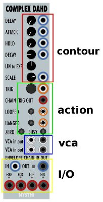
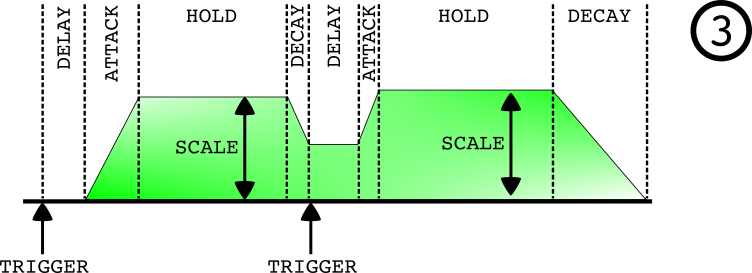

title: "Complex DAHD (0.6.30)"
author: "Jim Aikin"
date: "November 19, 2018"
output: html_document

##Description

The Complex DAHD is a contour generator. It can operate as an envelope generator or as an LFO. It also includes two VCA signal paths, with which it can control the amplitude of external signals using its own internally generated contour.

##The Contour Controls

The six knobs in the upper half of the module (see Figure 1) control the shape of the control signal that it generates. The four uppermost controls and their associated CV inputs affect the length of time the DAHD will spend in each of its four stages -- delay, attack, hold, and decay (see Figure 2). Unlike a conventional ADSR envelope generator, in which the Sustain parameter controls the level of the sustain segment of the envelope, the DAHD has four time controls. When a trigger signal arrives at the TRIG input or the manual TRIG button is pressed, the DAHD will proceed through its four envelope segments (with some variations to be described below).

When a trigger signal is received, the DAHD will wait (with a zero output) for the length of time controlled by the delay knob and CV input. The output signal will then rise to its maximum level at a rate determined by the attack knob and CV input. The output will remain at its maximum for the amount of time determined by the hold knob and CV, and will then fall back to zero at a rate determined by the decay controls.

The term "maximum," used above, requires a bit of nuance. The scale knob determines the level of the maximum output, and this knob is bidirectional. If it's turned to the left, the "maximum" will be less than zero. If this knob is in the vertical position, the DAHD's output will remain at zero. Modulating the scala parameter with a CV input is one of several ways of changing the shape of the DAHD's output while it's active.

The LIN to EXP knob controls the shapes of the attack and decay slopes. When it's turned to the right, the attack slope will be convex and the decay slope concave (that is, exponential), which will make them seem quicker. When it's turned to the left, the slopes will be nearly linear. Inspecting the DAHD output using the Fundamental Scope module is a good way to see what this knob does.

##Other Controls

The TRIG button duplicates the function of the input jack next to it. When a trigger is received, the DAHD produces an output signal. The CHAIN TRIG OUT jack below the trigger jack echoes the trigger, allowing multiple DAHD modules (or other devices) to start doing whatever they do at the same time.

The LOOPED input jack and button determine whether the DAHD will operate in one-shot (non-looped) or looped mode. In looped mode, the contour will cycle over and over: At the end of each cycle (when the decay segment ends), a new cycle will begin with the delay segment. The looped jack functions as a toggle. That is, trigger signals received at this jack will alternately switch loop mode off and then on. When loop mode is active, the button will be lighted. However, activating loop mode won't start a loop. A trigger must be received to start the first iteration of the loop.

If the DAHD is triggered while also looped, it will start a new cycle rather than finish the existing cycle (but see below). 

The HANGED input jack and button work similarly to the looped jack and button: The jack functions as a toggle. Trigger signals at this jack will alternately switch hanged mode off and then on. When the DAHD is in hanged mode (that is, the hanged lamp is lit), nothing will happen until the contour reaches the hold stage. When it reaches the hold stage, it will stay there (hang) until hanged mode is switched off.

The zero button has no meaning unless the module is asked (by a trigger signal) to start a new cycle before it has finished the current cycle. If the zero button is not lighted, the module will start a new cycle from the current (non-zero) position of the contour, whatever that happens to be, as shown in Figure 3. But if the zero button is lighted, the current contour will terminate abruptly, and a new contour will start at zero, as shown in Figure 4.

When the busy button is lighted, the module will ignore new trigger signals (see Figure 5) until it finishes cycling through its current contour. The busy button will have no effect if the module is looping and is receiving no trigger inputs, because each cycle of the loop will end before a new one starts.

##Other I/O

The output for the contour produced by the DAHD is on the right side near the bottom. The input to the left of the output jack can be used for chaining multiple modules together: Any signal received at the chain input will be added to the primary contour signal.

Two monophonic VCAs are included in the module. A signal at either VCA input will be multiplied by the current value of the contour. The VCAs will most often be used for processing audio signals, but you can just as easily send a secondary modulation source (such as another DAHD that is looping) through the VCA before patching it to the chain input.

The four jacks along the bottom of the module transmit triggers. The cryptic abbreviations above them stand for End Of Delay, End Of Rise (that is, end of attack), End Of Hold, and End Of Cycle (that is, end of the decay segment). The most common usage for these outputs will be to chain multiple DAHDs together to create complex contours. Extremely complex contours, both repeating and triggered -- or both at once -- can be produced by chaining two or three DAHD modules together.

