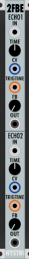
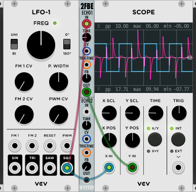
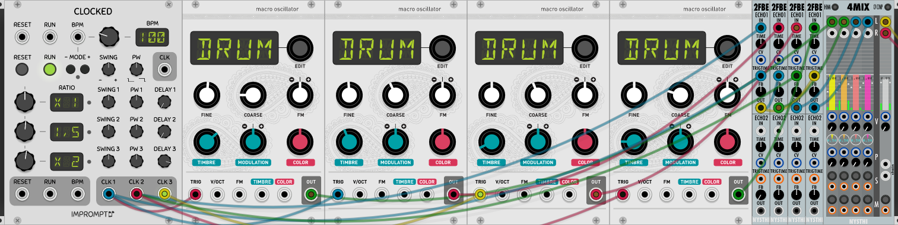

# Dual Feedback Delay (2FBE)



Type: Delay

Size: 2 HP

## Antonio Says

```
0.5.11.0
2 echos almost the same, the only differences are minimum maximum time

ECHO 1 goes from 0.05 msecs to 2000 msecs
ECHO 2 goes from 0.01 msecs to 200 msecs
TIME is the time control
CV is summed to TIME (if present)
TRIGTIME if used, overrides TIME and CV. Is a time computer, calculates timing of the incoming pulses and synchronized the echo
You can drive also with a VCO in input (or an LFO, of course)
FEEDBACK is amount of the ECHO that is summed back to top of the CHAIN
OUT is the OUT...

```

---

## Basics

Dual Feedback Echo is two delay units with different delay ranges. ECHO1 has a delay range of 0.05 to 2000 msecs. ECHO2 has a delay range of 0.01 to 200 msecs.

IN is the signal input. TIME adjusts the delay time and can be modulated with the CV input. TRIGTIME takes a clock pulse as input and syncs the delay time to it - this overrides TIME and CV. FB controls how much delayed signal is fed back into the chain. OUT outputs the delayed signal.



*Delay 375 msecs, feedback at 50%*

---

## Sample Patch

[2fbe_sample.vcv](./2fbe_sample.vcv) 



Drum circle with Dual Feedback Echo. The first 2FBE takes a clock pulse as input and sends the delayed output to the trigger input of two other units.

---
Author: John Hornik

Last Updated: 2019/05/27

Last Patch: 0.6.33
