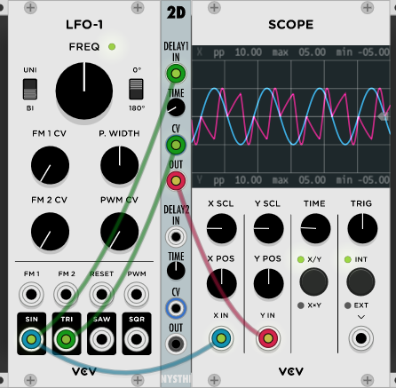
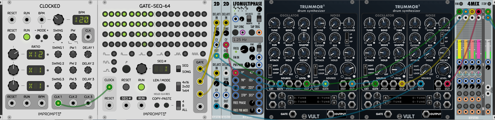

# Dual Signal Delayer (2D)


Type: Delay

Size: 2 HP

## Antonio Says

<details>
  <summary>Click to see the Changelog</summary>

```
0.4.0d

dual delay from 0 to 2000 msecs

both delays are CV controllable
```

</details>

---
## Basics

Signal is plugged into IN. The amount of delay is adjusted with TIME, from 0 to 2000 msecs - default is 1000 msecs. CV modulates the TIME knob. OUT outputs the delayed signal.


*Sine wave with 100 msec delay*

Using non-square waves to modulate the TIME parameter turns 2D into a complex waveshaper.



*Sine wave modulated by triangle wave, 100 msec delay*

---

## Sample Patch

[2d_sample.vcv](./2d_sample.vcv) 



The first 2D is being used to offset the hihat, and drag the snare slightly behind the beat. The second 2D offsets a copy of the kick pattern and is being modulated with a sine wave to give it a little funk.

---
Author: John Hornik

Last Updated: 2019/05/27

Last Patch: 0.6.33
