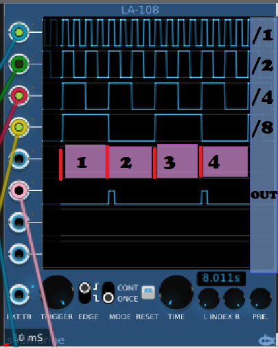

# Logic

Index
1. [Antonio Says](logic.md#antonio-says)
2. [Basics](logic.md#basics)
3. [In Practice](logic.md#in-practice)
    - [NOT Gates](logic.md#not-gates)
    - [AND, OR, & XOR Gates](logic.md#and-or--xor-gates)
4. [Why?](logic.md#why--)


Antonio says: 

	0.4.0 
		a simple module for boolean logic, Was my gym to learn VCV modules
	0.5.0
		streamlined version, and color codes... (white sockets, inputs, black sockets, outputs)
---
## Basics


Type: Utility / Trigger/Gate Control

Size: 5 HP

Description: 2 pairs each of ***DIGITAL*** AND, NOT, OR, and XOR Logic Gates. 

Digital is important here, because the module will *only* output a 100% duty cycle pulse wave at +5.00V when the Gate condition is matched.

---

## In Practice

Inputs are considered "ON" when the voltage is equal to or greater than +1.00 V, and ignore negative voltage altogether.

Outputs are either ON at +5V or OFF at 0V.

### NOT Gates

IN ON = OUT OFF

IN OFF = OUT ON

### AND, OR, & XOR Gates

|IN1|+|IN2|=|AND|OR|XOR| 
|---|---|---|---|---|---|---|
|OFF|+|OFF|-->|OFF|OFF|OFF|
|OFF|+|ON|-->|OFF|ON|ON|
|ON|+|OFF|-->|OFF|ON|ON|
|ON|+|ON|-->|ON|ON|OFF|

---

## Why?

There are many reasons to use Logic Gates in your patches, with just one of them being creating different rhythmic patterns.

For example: Say you wanted to set up a 4/4 backbeat-style pattern, where the Kick was on 1, and the Snare was on 2. 

You could:

``` \start and end codeblock with 3 backticks
   a) Fire up a sequencer and program it in (taking both screen and processing real estate); OR
   b) use your clock and a couple of Logics to set up the entire pattern.
```


As seen in the above patch, the output of:

	NOT bpm/8 
	AND bpm/4
	AND bpm/2
	AND bpm/1

Gives you a pulse on beat 2 and beat 4.


