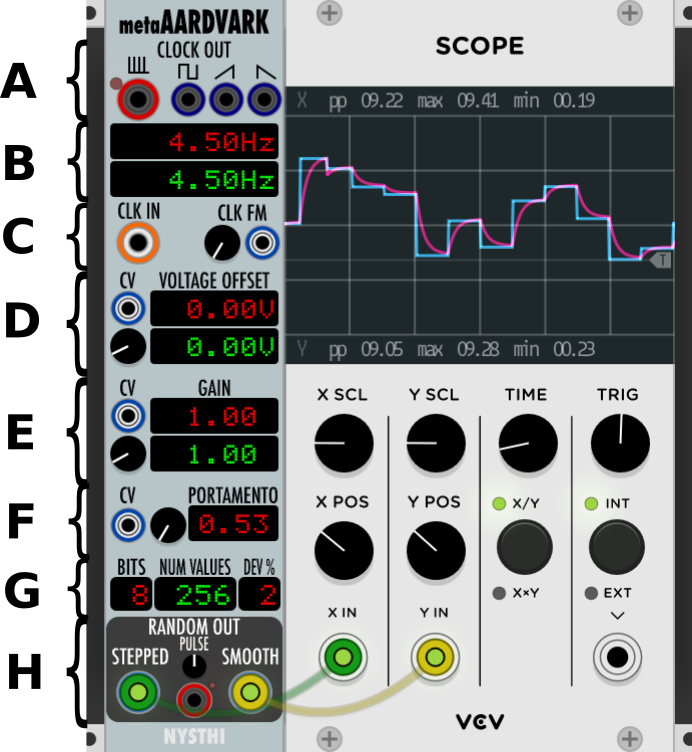

# metaAARDVARK

Author: Georg Carlson

**INDEX**
1. [Antonio says](#antonio-says)
2. [Basics](#basics)
3. [Functions by Section](#functions-by-section)
   - [Section A (Clock Outputs)](#section-a-clock-outputs)
   - [Section B (Clock Rate Displays)](#section-b-clock-rate-displays)
   - [Section C (Clock Inputs)](#section-c-clock-inputs)
   - [Section D (Voltage Offset)](#section-d-voltage-offset)
   - [Section E (Attenuverter)](#section-e-attenuverter)
   - [Section F (Portamento)](#section-f-portamento)
   - [Section G (Sample & Hold)](#section-g-sample--hold)
   - [Section H (Outputs)](#section-h-outputs)
4. [Usage](#usage)
5. [Sample Patches](#sample-patches)


## Antonio says

```
0.6.14

it's an attempt to obtain a super set of the RVG cell from the Warren Burt famous work "Aardvark IV"

http://www.warrenburt.com/my-history-with-music-tech2/

it's an LFO CLOCK S&H NOISE PULSE generator

contains a simulated R-2R resistor network (a vintage DAC) with deviations due to resistors tolerances (between 0% to 20%)

the deviations are recomputed every time the module is initialized or the DEV% param is changed

the simulated R-2R is from 1 bit (2 values) to 10 bits (1024 values)

values are subdivision of 10V
the OUTPUTS ARE:
   STEPPED = (SAMPLED VALUE * INNER GAIN) + INNER OFFSET
   SMOOTHED = PORTAMENTO(STEPPED)
   PULSE = STEPPED > COMPARATOR ? PULSE OUT : NOTHING;

PARAMETERS
   SECTION 1: CLOCK OUT
      PULSE TRAIN OUT
      SQUARE OUT
      RAMP UP OUT
      RAMP DOWN OUT
	  
   SECTION 2: CLOCK HZ DISPLAYS
      CLICK and DRAG display to set frequency of the pulse/sampler from 0.01Hz to 8kHz
      Display for modulated Hz
	  
   SECTION 3: CLK IN
      CLK IN overrides the inner clock, the CLK In is copied ot the CLOCK OUT to create a CHAIN of CLOCKED metaAARDVARK
      CLK FM CV + CV VCA to modulta the inner CLOCK
	  
   SECTION 4: VOLTAGE OFFSET
      CLICK and DRAG display to set VOLTAGE OFFSET from -15v to +15v
      Display for modulated OFFSET
      CV IN and VCA to modulate the OFFSET
	  
   SECTION 5: GAIN
      CLICK and DRAG display to set GAIN from -2.0x to +2.0x
      Display for modulated GAIN
      CV IN and VCA to modulate the GAIN
	  
   SECTION 6: PORTAMENTO (the portamento act only on the SMOOTHED OUT)
      CLICK and DRAG display to set PORTAMENTO from 0.0 to 1.0
      CV IN and VCA to modulate the PORTAMENTO
	  
   SECTION 7: RESOLUTION
      CLICK and DRAG display to set resolution from 1 bit to 10bits (from 2 to 1024 values)
      CLICK and DRAG display to set the DEVIATION of resistors of the simulated DAC (from 0 % to 20% tolerance)
	  
   SECTION 8: OUT
      STEPPED OUT the current value selected for the current resolution with OFFSET and GAIN
      SMOOTHED OUT the current STEPPED OUT value filtered by PORTAMENTO
      PULSE OUT uses a COMPARATOR (knob) settable from 0.01v to 9.99v;
      when the selected value is higher than KNOB a PULSE is emitted

0.6.15
	add guard for non finite numbers

0.6.16
	clamping portamento also if no modulations are in

0.6.26
	BUG: wrong behaviour of the smooth output when opening a patch
```

---

## Basics



Type: Clock  / LFO / S&H / Noise

Size: 6 HP

---

## Functions by Section

### Section A (Clock Outputs)

From Left to Right: 

- Pulse (~0.1 ms long)
- Square (50% Pulse Width)
- Ramp Up
- Ramp Down

While you can output at audio rate frequencies (ie. above 20 Hz), the resulting audio will be of lower quality (due to aliasing), so per Antonio, this module is best used at LFO rates, and not as an audio rate modulator.

### Section B (Clock Rate Displays)

The Red Display is drag-to-change, the further left the cursor is click-and-dragged in the display, the faster it will adjust up or down.

The Green Display tracks the current Clock Rate:

- As selected in the Red Display (assuming nothing is patched in Section C);
- As detected at CLK IN (External Clock); or
- Either of the above as modulated by the CV signal at the CLK FM input 

***Default Clock Rate: 10.00 Hz***

***Min Clock Rate: 0.01 Hz***

***Max Clock Rate: 8000 Hz***

### Section C (Clock Inputs)

From Left to Right:

- CLK IN to the left, 
- CLK FM Attenuator and CV Input

### Section D (Voltage Offset)

Affects the outputs in ([Section H](#section-h-outputs)\), and applies an offset to the baseline voltage, ranging between -/+15.00 V.

Red Display is drag-to-change as per [Section B](#section-b-clock-rate-displays).

Green Display tracks the current offset, either:

- As selected on the Red Display; or 
- As modulated by the CV Input/Attenuator (which accepts Maximum -/+15.00 V signals)

***Default Offset: 0.00 V***

### Section E (Attenuverter)

Multiplies the signals output in ([Section H](#section-h-outputs)\) by a value between -2.00x and +2.00x.

Red Display is drag-to-change as per [Section B](#section-b-clock-rate-displays).

Green Display tracks the current gain:

- As selected on the Red Display; or
- As modulated by the CV Input/Attenuator (at a scale of 1.00x per 5.00 V, Limited to -/+2.00x)

***Default Gain: 1.00x***

### Section F (Portamento)

Applies Portamento to the SMOOTH CV Out of ([Section H](#section-h-outputs)\), from 0% to 100%. Settings above 0.90 affect the signal quite drastically.

Set by:
- Clicking and dragging in the red display; and/or
- Modulating with the CV Input/Attenuator (No display of the current value). Voltages outside of -/+5.00 V may make no difference in the value (unsure despite intensive testing).

***Default Value: 0.50***

### Section G (Sample & Hold)

It can hold 1-10 bits (2 Values to 1024 values). [Warren Burt, The creator of the hardware which inspired this module,](http://www.warrenburt.com/my-history-with-music-tech2/) asked Antonio to emulate the vintage Digital to Analog Converter as faithfully as possible, meaning it had to be able to also emulate the +/- 20% variability of the hardware, so here we have a variability of 0% to 20%, user settable. The default is 2% variability.

This means that if, for example, you set the network to 1 bit and variability to 2% then, if the variability deviates from the 2 possible values of (for this example) 0 V and 5V, with 20% the 0v could move between -1v to +1v and the 5v between 4v and 6v.

***Bits Range: 1 - 10***

***Voltage Deviation (%): 0-20***


### Section H (Outputs)

From left to right:
- STEPPED CV Out
  - Outputs the value generated by the Sample & Hold ([Section G](#section-g-sample--hold)\), multiplied by the Gain ([Section E](#section-e-attenuverter)\), plus the Offset ([Section D](#section-d-voltage-offset)\). (Seen as the blue Scope signal in the [image above](#basics)\)
- PULSE Trig Out with Comparator 
  - The knob has a range of +0.01 V to +9.99 V ***(Default: +5.00 V)***
  - If the STEPPED CV Out signal is above the knob's value when the Clock triggers, a Pulse is Output.
  - As per NYSTHI Standard, PULSE Trig Out is ~0.1 ms
- SMOOTH CV Out 
  - Outputs the value of the current STEPPED CV Out signal after it is filtered through the Portamento ([Section F](#section-f-portamento)\). (Seen as the pink Scope signal in the [image above](#basics) \)

===

## Usage

*All red displays can be clicked and dragged up/down to set. The further left you click the faster it changes*

Use the [Clock Outputs] (#section-a-clock-outputs) to modulate/trigger other modules

With no [Clock IN](#section-c-clock-inputs) patched in, it uses the internal clock (settable in Section B via red display)) 
- To vary speed over time feed a slow sine LFO into the Clock FM CV input and attenuate to taste with the pod to it's left.

External [Clock IN](#section-c-clock-inputs) overrides internal clock. Green display (Section B) tracks the incoming frequency
- To vary speed over time feed a slow sine LFO into the Clock FM CV input and attenuate to taste with the knob to it's left
- If your clock pulse is irregular this can make for some very unstable mess with all the Clock outs in [Section A](#section-a-clock-outputs).

Use the [Stepped/Smooth/Pulse Outs](#section-h-outputs) to trigger stuff and generate pitch CV to feed your oscillators with. 
     - Might need some attenuverting to tame the range/offset
     - Play with the Comparator knob above the Pulse out to get the trigger outs you want

Plug something into everything and see what happens ;)

===

## Sample Patches

[MetaAardvark_Sample_Patch.vcv](./MetaAardvark_Sample_Patch.vcv) by Georg Carlson


    
