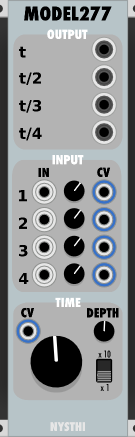
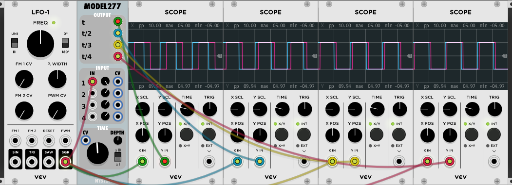
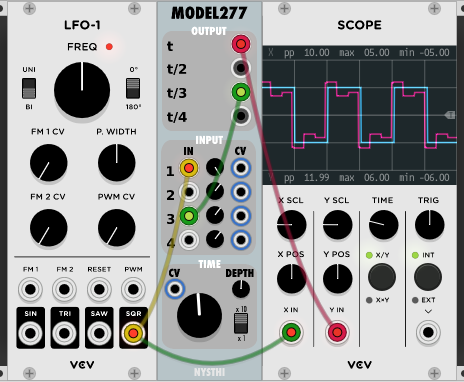
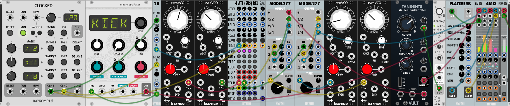

# Model 277



Type: Delay

Size: 7 HP

Modeled After/Inspired by: Buchla 277

## Antonio Says

<details>
  <summary>Click to see the Changelog</summary>

```
	0.4.0
a feedback delay tool, freely inspired from Buchla 277

	0.4.0b
removed filters from feedback paths
removed smoothers on parameters changes
timing is now the same as the Buchal 277 from 5 to 200 msecs
added 10x time multiplier, bringing the time from 50 to 2000 msecs
solved a bug on feeback paths 3 and 4

	0.6.2
protect from init to time ZERO
```

</details>

---

## Basics

Model 277 is inspired by the Buchla 277 delay unit. You can see a hardware version in action at [this Muff Wiggler post][1] by Todd Barton that includes a couple of videos. There is also [this ModularSynthesis.com page][2] with some technical info from the guy who built the unit Barton is using.

[1]: http://www.muffwiggler.com/forum/viewtopic.php?p=1373034
[2]: https://modularsynthesis.com/roman/buchla277/277_sdu.htm

The top OUTPUT section contains four delayed outputs. Delay time at output *t* is controlled by the TIME knob. The others are divisions of the delay at output *t*.



*Each of the four outputs scoped against a dry signal, with the default delay of 100 msecs*

The middle INPUT section contains four inputs. The input signals are modulated by either the attenuverters or the CV inputs.

The bottom TIME section has a large knob to adjust the delay time. Range is from 5 to 200 msecs, default is 100 msecs. The x10 switch makes the delay range 50 to 2000 msecs. The CV input is used for an FM modulator signal, with DEPTH controlling the amount of modualtion.

Complex delays can be built up by connecting the outputs to the inputs creating a feedback loop. Since this models an analog feedback loop, it will overload quickly as you turn up the input level. 



*Feedback loop with output* t/3, *delay of 1000 msecs*

---

## Sample Patch

[277_sample.vcv](./277_sample.vcv) 



Two patterns made with feedback loops. The second pair of VCOs is doing FM on the delays.

---
Author: John Hornik

Last Updated: 2019/05/27

Last Patch: 0.6.33
