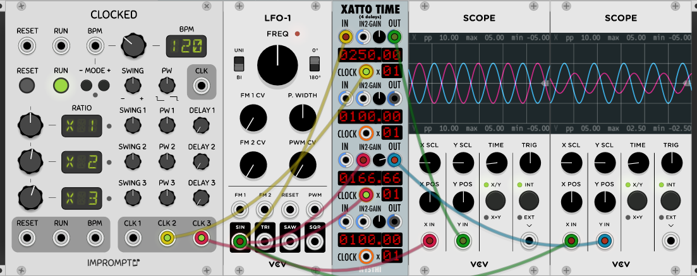

# Xatto Time
---
Author: John Hornik

Last Updated: 2019/05/23

Last Patch: 0.6.33

## Antonio Says

```
XATTO TIME (4 delays)
	0.5.13.0
---- 4 delays
---- every delay can accept audio or CV
---- delay from 0.01 msecs to 9999.99 msecs
---- click and drag to set PRECISE timing
---- no filter IN or OUT
---- there are 2 IN, the IN2 is controlled by an attenenverter (to create feedbacks)
---- every delay is clockable and tempo is computed with the tempo detector
---- the detected tempo is multiplied by a factor from 1 to 99

	0.6.0
default gain for IN2 to ZERO (feature request)

	0.6.4
corrected value skewing when dragging and the screen is zoomed

	0.6.20
time computer sample rate update
```

---

## Basics


Type: Delay

Size: 7 HP

Xatto Time is four clockable signal delays. Signal connects to IN or IN2 - IN2 has an attenuverter to control the depth of the input signal, otherwise they are the same. OUT is the delayed output. 

The Red Display is click-and-drag to change the delay time - range is 0.01 to 9999.99 msecs, default is 100 msecs. A signal input at CLOCK matches the delay time to that clock, and can be multiplied by a factor of 1 to 99, adjustable by the click-and-drag Red Display to it's right.



*The first scope shows a 2hz sine wave delayed by a double-time clock pulse. The second scope shows the same sine attenuated at IN2 and delayed by a triplet clock pulse.*

---


## Sample Patch

[xatto_sample.vcv](./xatto_sample.vcv) 


Cascading delays with Xatto Time. CLK3 sets the delays to triplet time. The second oscillator is triggered by a half-time clock and delayed by half a triplet to create an offset pattern twice as slow as the first.
